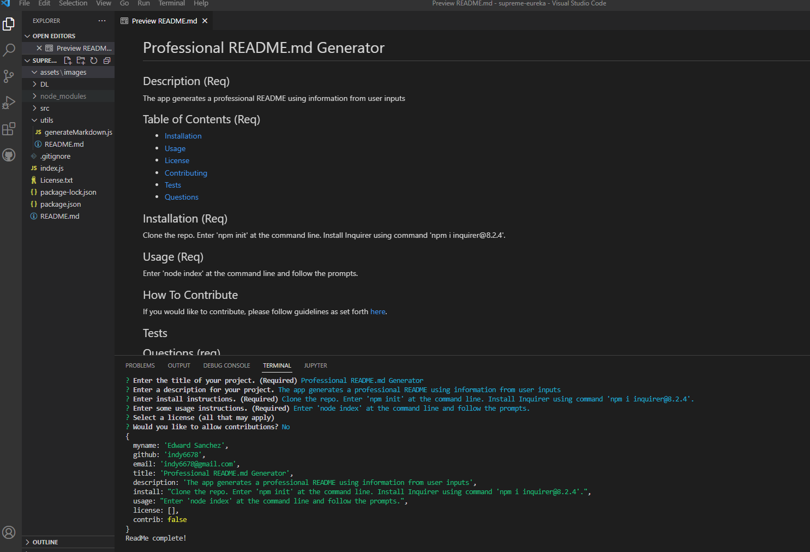

# Professional README Generator

## Description

Generates a professional README.md from user inputs

## Table of Contents

- [Installation](#installation)
- [Usage](#usage)
- [License](#license)
- [Questions](#questions)

## Installation

Clone Repo. Then, run 'npm init' at the prompt. After that, install Inquirer by running 'npm i inquirer@8.2.4' at prompt.

## Usage

Enter 'node index' at prompt and follow the prompts that appear.

## Licensing

[MIT License](https://github.com/indy6678/supreme-eureka/blob/c6ddeae080abb18b4020816edc5585197f7c9383/License.txt)

## Questions

GitHub Username: indy6678 
GitHub link: https://github.com/indy6678 
- For more information, feel free to reach me at indy6678@gmail.com.
